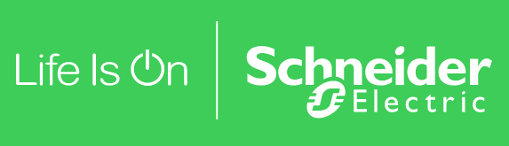
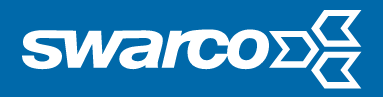

Η Micara είναι μια εταιρεία ανάλυσης δεδομένων και μηχανικής μάθησης που επικεντρώνεται σε ενσωματωμένα συστήματα από μικροελεγκτές έως βιομηχανικούς υπολογιστές, οπότε στην ουσία είναι μια εταιρεία παροχής τεχνικών συμβουλών EDGE και ανάπτυξης υλικού και λογισμικού. 

Επικεντρωνόμαστε στην ανάπτυξη και υλοποίηση ενσωματωμένων συστημάτων από μικροελεγκτές έως βιομηχανικούς υπολογιστές. Προσφέρουμε στους πελάτες μας καινοτόμες λύσεις που βασίζονται στις τελευταίες τεχνολογίες και μεθόδους ανάλυσης δεδομένων και μηχανικής μάθησης. 

Στόχος της εταιρείας μας είναι να φέρει τη δύναμη της ανάλυσης δεδομένων και της μηχανικής μάθησης στον κόσμο των ενσωματωμένων συστημάτων. Συνεργαζόμαστε στενά με τους πελάτες μας για την ανάπτυξη εξατομικευμένων λύσεων που ανταποκρίνονται στις συγκεκριμένες απαιτήσεις τους. Η ομάδα έμπειρων μηχανικών και αναλυτών δεδομένων που διαθέτουμε έχει εκτεταμένες γνώσεις στην επεξεργασία σήματος, την αναγνώριση προτύπων και τη μηχανική μάθηση. 

Οι υπηρεσίες μας περιλαμβάνουν την ανάπτυξη λογισμικού ενσωματωμένων συστημάτων, την υλοποίηση αλγορίθμων μηχανικής μάθησης, την ανάλυση δεδομένων και την ανάπτυξη προσαρμοσμένων λύσεων ανάλυσης δεδομένων. Προσφέρουμε επίσης συμβουλευτικές υπηρεσίες για να βοηθήσουμε τους πελάτες μας να επιλέξουν την καλύτερη τεχνολογία και μέθοδο για τις απαιτήσεις τους. 

Η ομάδα διαθέτει συνδυασμένη εμπειρία σχεδόν 20 ετών σε βιομηχανικές λύσεις για τη μηχανολογία, την αεροδιαστημική, τη ρομποτική και τη μεταποίηση. Ένας ιδιαίτερα ενδιαφέρων τομέας για τη χρήση των προαναφερόμενων τεχνολογιών είναι. Είμαστε υπερήφανοι που συνεργαζόμαστε με ορισμένες από τις κορυφαίες εταιρείες αυτών των κλάδων, παρέχοντάς τους καινοτόμες λύσεις που αυξάνουν την παραγωγικότητα και την ανταγωνιστικότητά τους. 

Στη Micara δίνουμε μεγάλη έμφαση στην ποιότητα και την αξιοπιστία. Εφαρμόζουμε βέλτιστες πρακτικές για να διασφαλίσουμε ότι οι λύσεις μας πληρούν τα υψηλότερα πρότυπα. Προσπαθούμε διαρκώς να βελτιώνουμε τις διαδικασίες και τις υπηρεσίες μας, ώστε να διασφαλίζουμε ότι μπορούμε να προσφέρουμε τις καλύτερες λύσεις στους πελάτες μας. 

Αν αναζητάτε καινοτόμες και εξατομικευμένες λύσεις στον τομέα της ανάλυσης δεδομένων και της μηχανικής μάθησης για ενσωματωμένα συστήματα, επικοινωνήστε μαζί μας. Είμαστε έτοιμοι να σας βοηθήσουμε να επιτύχετε τους στόχους σας. 

Αναφορές 

Έχουμε συνεργαστεί με τις ακόλουθες εταιρείες, μεταξύ άλλων: 

Pellenc (FR) 

 

Schneider Electric (Ηνωμένο Βασίλειο) 

Swarco (DE)

Bosch Connected Devices and Solutions (DE)

### Συνεργάτες  

Τέλος, έχουμε μια μακροχρόνια και καλή συνεργασία με την Edge Impulse (ΗΠΑ)  

